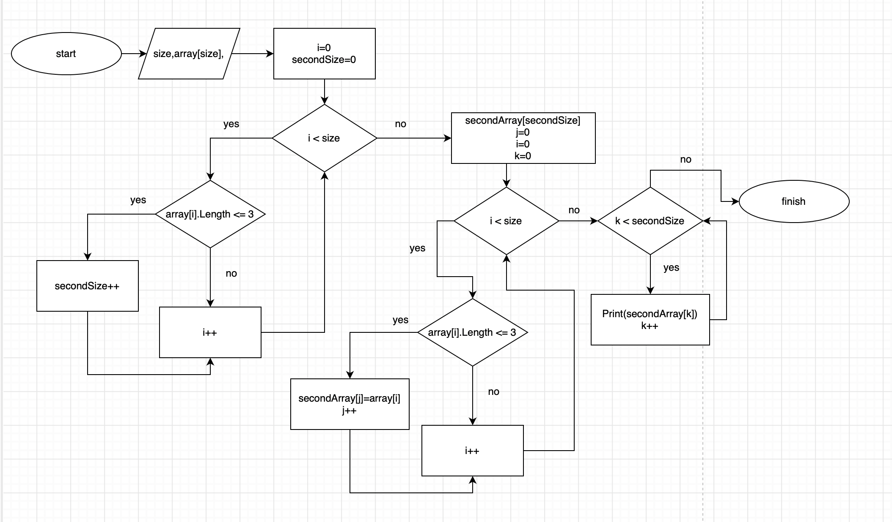

# Текстовое описание решения

Предоставленный код на C# считывает пользовательские строки, сохраняет их в массиве и затем фильтрует строки, создавая второй массив, в котором остаются только те строки, длина которых меньше или равна 3 символам. Затем он выводит содержимое обоих массивов. Вот разбор кода:

Пользователю предлагается задать количество строк, которые будут введены, а затем задать и сами строки. На основании этой информации создается массив `array`, в который с помощью цикла `for` считываются введенные пользователем строки .

Затем с помощью цикла `for` перебирается весь массив и подсчитывается количество строк, длина которых меньше или равна 3. Полученное число будет являться размером второго массива `secondArray`.

Далее опять "проходимся" по массиву `array` и, определяя строки с конкретным количеством символов, записываем их во второй массив.

Наконец, выводим содержимое массива `secondArray`.

Блок-схема алгоритма предсталена ниже:
